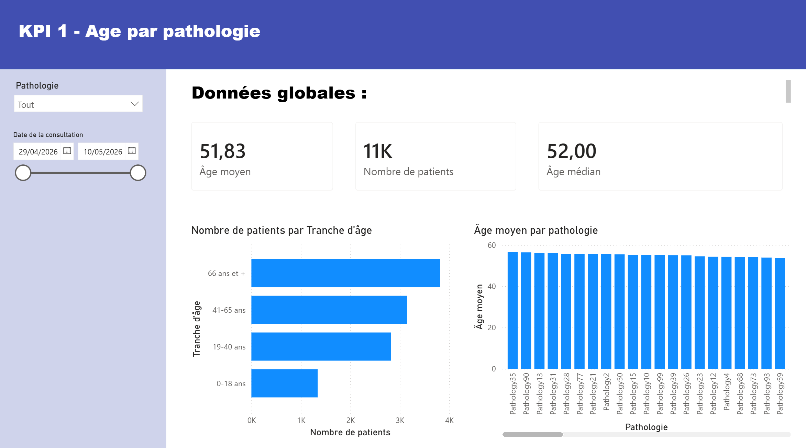
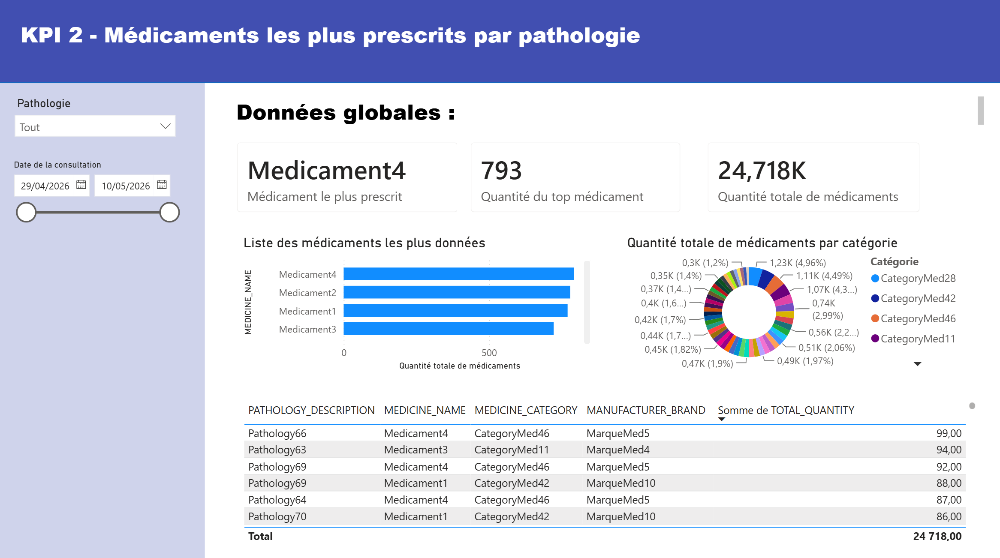
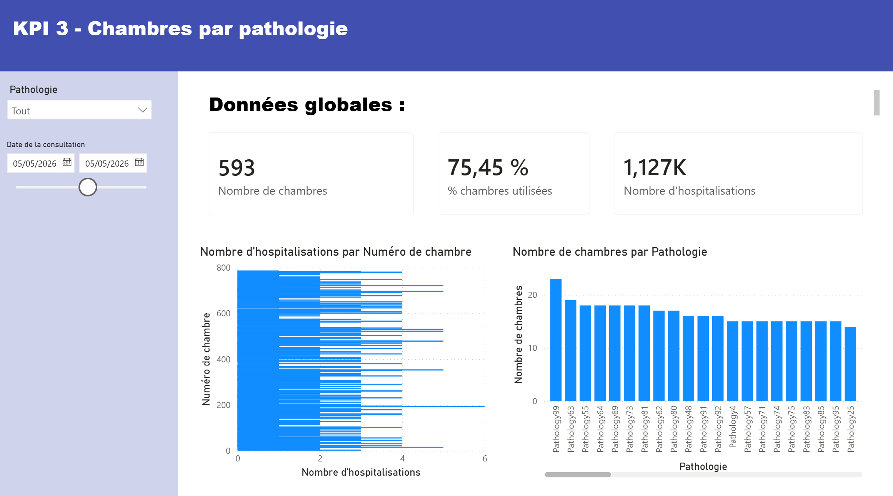
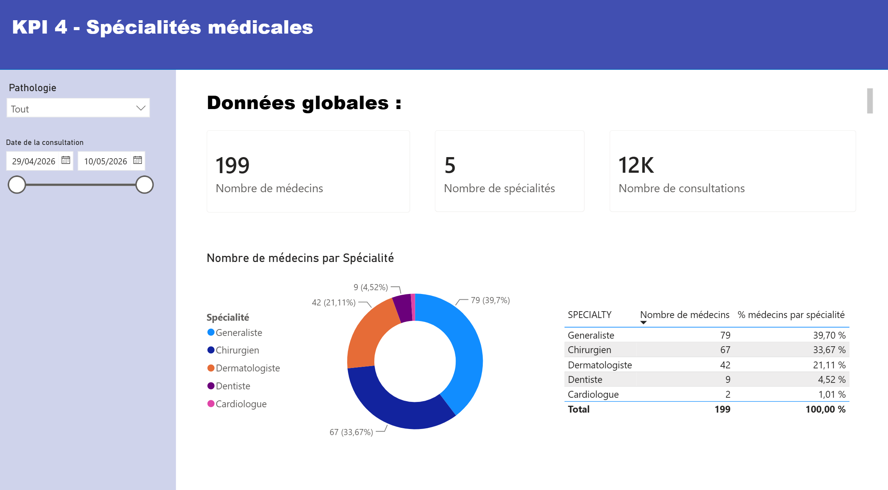
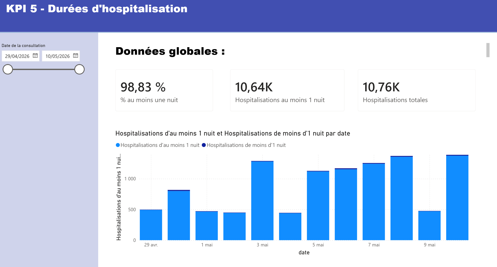
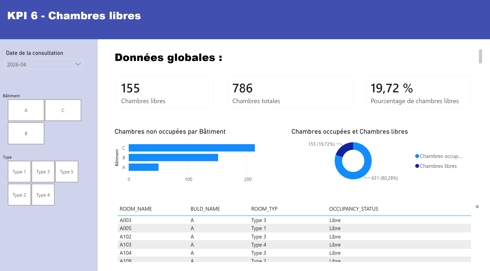

# bi-platform

[](dbt/dbt_project.yml)
[](dbt/dbt_project.yml)
[](airflow)
[](docs/screenshots)
[](.python-version)
[](.github/workflows/ci.yml)

A full business intelligence pipeline for a hospital: raw daily exports go
in, and clean, historized, query-ready tables come out on the other end,
feeding a set of Power BI dashboards. In short, it turns messy operational
data into numbers a hospital's management can actually act on, like which
rooms are free, which pathologies are most common by age group, or which
medications get prescribed the most.

## Dashboard

| | |
|---|---|
|  |  |
|  |  |
|  |  |

## How the data flows

```text
inputs/Data Hospital/BDD_HOSPITAL_YYYYMMDD/
        |  (7 files, ; separated, 1 batch/day)
        v
   Snowflake
   +-- Staging / ODS   (ingestion, quality control, rejection)
   +-- Travail         (deduplication, business-rule unification)
   +-- Socle / Vue     (historized facts/dimensions, KPIs)  --> Power BI
        dbt (transformations), Airflow (orchestration)
```

Source tables (`PATIENT`, `PERSONNEL`, `CHAMBRE`, `MEDICAMENT`,
`CONSULTATION`, `TRAITEMENT`, `HOSPITALISATION`) form a small OLTP-shaped
hospital schema: patients, staff, rooms, consultations, prescriptions,
and stays. dbt reshapes this into a Kimball-style star schema in the
Socle/Vue layer, which is what Power BI actually queries.

## Stack

| Layer | Tool |
|---|---|
| Data warehouse | Snowflake |
| Transformations | dbt (staging, intermediate, marts) |
| Orchestration | Apache Airflow |
| Reporting | Power BI |
| Pipeline utilities | Python 3.12, `uv`, `ruff`, `mypy --strict` |
| CI | GitHub Actions (lint, type-check, dbt build) |

## Running the dbt project

```bash
cp .env.example .env   # fill in Snowflake credentials
dbt debug              # test the connection
dbt run                # build all models
dbt test                # run data quality tests
dbt docs generate && dbt docs serve  # browse the lineage graph
```

## Repository structure

```text
bi-platform/
├── dbt/            # models (staging/intermediate/marts), tests, macros
├── airflow/        # orchestration DAGs
├── snowflake/      # database/schema/warehouse setup DDL
├── inputs/         # source flat files (read-only)
└── instructions/   # original project brief (read-only reference)
```

## Context

Built as a 4-sprint group project for **NF26** (a decision-support
systems course) supervised by [SMART TEEM](https://www.smartteem.fr/), a
data-consulting firm that reviewed the deliverables and set the grading
criteria. Team of 6; I drove most of the dbt modeling and pipeline work
(majority of commits), alongside the Airflow orchestration.

## Contributors

Pierre Fromont Boissel, Lucas Silva, Matheo Gros, Rania El Alami, Robin Lanfranchi, Eliott Meyzenq.
