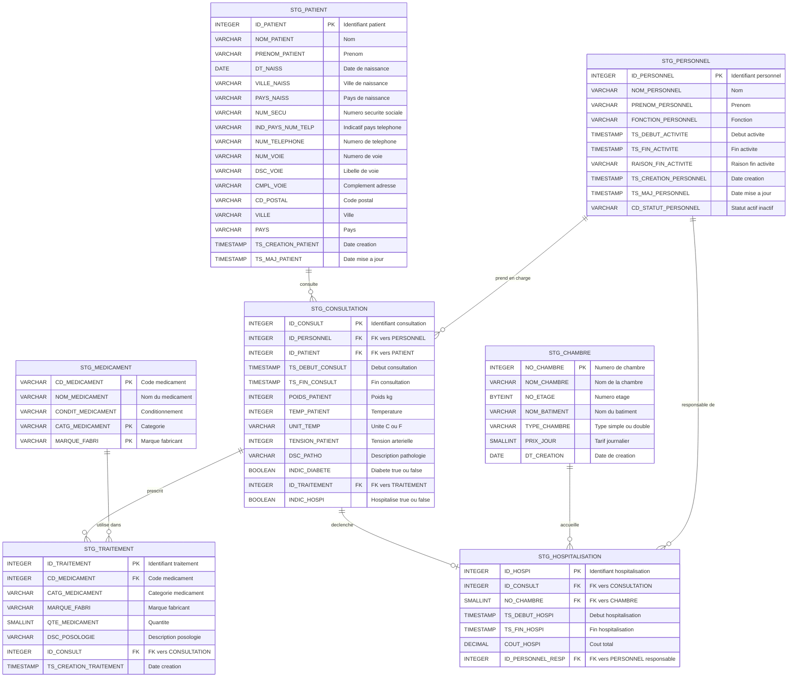

# Étape 1 — Staging (STG)

Chargement des fichiers plats source dans le schéma **STG** de Snowflake.
Référence : `inputs/Hopital Mapping VF.xlsx` (onglet *Staging*) et `inputs/Hopital CI VF.xlsx`.

---

## Stratégie de chargement

| Table             | Périmètre CI | Stratégie                         | Raison                                        |
| ----------------- | ------------ | --------------------------------- | --------------------------------------------- |
| `CHAMBRE`         | full         | **Rechargement complet**          | Référentiel stable, peu de lignes             |
| `MEDICAMENT`      | full         | **Rechargement complet**          | Catalogue de référence                        |
| `PERSONNEL`       | full         | **Rechargement complet**          | Données RH complètes à chaque batch           |
| `PATIENT`         | delta        | **Delta (ajouts + mises à jour)** | Volume croissant, `TS_MAJ_PATIENT` disponible |
| `CONSULTATION`    | delta        | **Delta**                         | Transactions quotidiennes                     |
| `TRAITEMENT`      | delta        | **Delta**                         | Transactions quotidiennes                     |
| `HOSPITALISATION` | delta        | **Delta**                         | Transactions quotidiennes                     |

**Format des fichiers** : UTF-8, séparateur `;`, une ligne d'en-tête, un dossier par jour
(`inputs/Data Hospital/BDD_HOSPITAL_YYYYMMDD/TABLE_YYYYMMDD.txt`).

---

## Diagramme ERD — couche STG

> Les contraintes FK ne sont pas appliquées en staging (données brutes).
> Les liens représentent les jointures métier logiques.

---

## Mapping détaillé par table

### CHAMBRE — rechargement complet (full)

| Fichier source         | Colonne source | Type source | Colonne STG    | Type STG    | Obligatoire |
| ---------------------- | -------------- | ----------- | -------------- | ----------- | ----------- |
| `CHAMBRE_YYYYMMDD.txt` | `NO_CHAMBRE`   | NUMBER      | `NO_CHAMBRE`   | INTEGER     | Oui (PK)    |
| `CHAMBRE_YYYYMMDD.txt` | `NOM_CHAMBRE`  | STRING(20)  | `NOM_CHAMBRE`  | VARCHAR(20) | Oui         |
| `CHAMBRE_YYYYMMDD.txt` | `NO_ETAGE`     | NUMBER      | `NO_ETAGE`     | BYTEINT     | —           |
| `CHAMBRE_YYYYMMDD.txt` | `NOM_BATIMENT` | STRING(20)  | `NOM_BATIMENT` | VARCHAR(20) | —           |
| `CHAMBRE_YYYYMMDD.txt` | `TYPE_CHAMBRE` | STRING(10)  | `TYPE_CHAMBRE` | VARCHAR(10) | —           |
| `CHAMBRE_YYYYMMDD.txt` | `PRIX_JOUR`    | NUMBER      | `PRIX_JOUR`    | SMALLINT    | Oui         |
| `CHAMBRE_YYYYMMDD.txt` | `DT_CREATION`  | DATE        | `DT_CREATION`  | DATE        | Oui         |

### MEDICAMENT — rechargement complet (full)

| Fichier source            | Colonne source      | Type source | Colonne STG         | Type STG     | Obligatoire |
| ------------------------- | ------------------- | ----------- | ------------------- | ------------ | ----------- |
| `MEDICAMENT_YYYYMMDD.txt` | `CD_MEDICAMENT`     | STRING(10)  | `CD_MEDICAMENT`     | VARCHAR(10)  | Oui (PK)    |
| `MEDICAMENT_YYYYMMDD.txt` | `NOM_MEDICAMENT`    | STRING(250) | `NOM_MEDICAMENT`    | VARCHAR(250) | —           |
| `MEDICAMENT_YYYYMMDD.txt` | `CONDIT_MEDICAMENT` | STRING(100) | `CONDIT_MEDICAMENT` | VARCHAR(100) | —           |
| `MEDICAMENT_YYYYMMDD.txt` | `CATG_MEDICAMENT`   | STRING(100) | `CATG_MEDICAMENT`   | VARCHAR(100) | Oui (PK)    |
| `MEDICAMENT_YYYYMMDD.txt` | `MARQUE_FABRI`      | STRING(100) | `MARQUE_FABRI`      | VARCHAR(100) | Oui (PK)    |

> La clé primaire de MEDICAMENT est la combinaison `(CD_MEDICAMENT, CATG_MEDICAMENT, MARQUE_FABRI)`.

### PERSONNEL — rechargement complet (full)

| Fichier source           | Colonne source          | Type source | Colonne STG             | Type STG     | Obligatoire |
| ------------------------ | ----------------------- | ----------- | ----------------------- | ------------ | ----------- |
| `PERSONNEL_YYYYMMDD.txt` | `ID_PERSONNEL`          | NUMBER      | `ID_PERSONNEL`          | INTEGER      | Oui (PK)    |
| `PERSONNEL_YYYYMMDD.txt` | `NOM_PERSONNEL`         | STRING(100) | `NOM_PERSONNEL`         | VARCHAR(100) | Oui         |
| `PERSONNEL_YYYYMMDD.txt` | `PRENOM_PERSONNEL`      | STRING(100) | `PRENOM_PERSONNEL`      | VARCHAR(100) | Oui         |
| `PERSONNEL_YYYYMMDD.txt` | `FONCTION_PERSONNEL`    | STRING(50)  | `FONCTION_PERSONNEL`    | VARCHAR(50)  | Oui         |
| `PERSONNEL_YYYYMMDD.txt` | `TS_DEBUT_ACTIVITE`     | DATETIME    | `TS_DEBUT_ACTIVITE`     | TIMESTAMP(0) | Oui         |
| `PERSONNEL_YYYYMMDD.txt` | `TS_FIN_ACTIVITE`       | DATETIME    | `TS_FIN_ACTIVITE`       | TIMESTAMP(0) | —           |
| `PERSONNEL_YYYYMMDD.txt` | `RAISON_FIN_ACTIVITE`   | STRING(100) | `RAISON_FIN_ACTIVITE`   | VARCHAR(100) | —           |
| `PERSONNEL_YYYYMMDD.txt` | `TS_CREATION_PERSONNEL` | DATETIME    | `TS_CREATION_PERSONNEL` | TIMESTAMP(0) | Oui         |
| `PERSONNEL_YYYYMMDD.txt` | `TS_MAJ_PERSONNEL`      | DATETIME    | `TS_MAJ_PERSONNEL`      | TIMESTAMP(0) | Oui         |
| `PERSONNEL_YYYYMMDD.txt` | `CD_STATUT_PERSONNEL`   | STRING(10)  | `CD_STATUT_PERSONNEL`   | VARCHAR(10)  | Oui         |

### PATIENT — delta

| Fichier source         | Colonne source        | Type source | Colonne STG           | Type STG     | Obligatoire |
| ---------------------- | --------------------- | ----------- | --------------------- | ------------ | ----------- |
| `PATIENT_YYYYMMDD.txt` | `ID_PATIENT`          | NUMBER      | `ID_PATIENT`          | INTEGER      | Oui (PK)    |
| `PATIENT_YYYYMMDD.txt` | `NOM_PATIENT`         | STRING(100) | `NOM_PATIENT`         | VARCHAR(100) | Oui         |
| `PATIENT_YYYYMMDD.txt` | `PRENOM_PATIENT`      | STRING(100) | `PRENOM_PATIENT`      | VARCHAR(100) | Oui         |
| `PATIENT_YYYYMMDD.txt` | `DT_NAISS`            | DATE        | `DT_NAISS`            | DATE         | —           |
| `PATIENT_YYYYMMDD.txt` | `VILLE_NAISS`         | STRING(100) | `VILLE_NAISS`         | VARCHAR(100) | —           |
| `PATIENT_YYYYMMDD.txt` | `PAYS_NAISS`          | STRING(100) | `PAYS_NAISS`          | VARCHAR(100) | —           |
| `PATIENT_YYYYMMDD.txt` | `NUM_SECU`            | STRING(15)  | `NUM_SECU`            | VARCHAR(15)  | —           |
| `PATIENT_YYYYMMDD.txt` | `IND_PAYS_NUM_TELP`   | STRING(5)   | `IND_PAYS_NUM_TELP`   | VARCHAR(5)   | —           |
| `PATIENT_YYYYMMDD.txt` | `NUM_TELEPHONE`       | STRING(20)  | `NUM_TELEPHONE`       | VARCHAR(20)  | —           |
| `PATIENT_YYYYMMDD.txt` | `NUM_VOIE`            | STRING(10)  | `NUM_VOIE`            | VARCHAR(10)  | —           |
| `PATIENT_YYYYMMDD.txt` | `DSC_VOIE`            | STRING(250) | `DSC_VOIE`            | VARCHAR(250) | —           |
| `PATIENT_YYYYMMDD.txt` | `CMPL_VOIE`           | STRING(250) | `CMPL_VOIE`           | VARCHAR(250) | —           |
| `PATIENT_YYYYMMDD.txt` | `CD_POSTAL`           | STRING(10)  | `CD_POSTAL`           | VARCHAR(10)  | —           |
| `PATIENT_YYYYMMDD.txt` | `VILLE`               | STRING(100) | `VILLE`               | VARCHAR(100) | —           |
| `PATIENT_YYYYMMDD.txt` | `PAYS`                | STRING(100) | `PAYS`                | VARCHAR(100) | —           |
| `PATIENT_YYYYMMDD.txt` | `TS_CREATION_PATIENT` | DATETIME    | `TS_CREATION_PATIENT` | TIMESTAMP(0) | Oui         |
| `PATIENT_YYYYMMDD.txt` | `TS_MAJ_PATIENT`      | DATETIME    | `TS_MAJ_PATIENT`      | TIMESTAMP(0) | Oui         |

### CONSULTATION — delta

| Fichier source              | Colonne source     | Type source | Colonne STG        | Type STG     | Obligatoire |
| --------------------------- | ------------------ | ----------- | ------------------ | ------------ | ----------- |
| `CONSULTATION_YYYYMMDD.txt` | `ID_CONSULT`       | NUMBER      | `ID_CONSULT`       | INTEGER      | Oui (PK)    |
| `CONSULTATION_YYYYMMDD.txt` | `ID_PERSONNEL`     | NUMBER      | `ID_PERSONNEL`     | INTEGER      | Oui         |
| `CONSULTATION_YYYYMMDD.txt` | `ID_PATIENT`       | NUMBER      | `ID_PATIENT`       | INTEGER      | Oui         |
| `CONSULTATION_YYYYMMDD.txt` | `TS_DEBUT_CONSULT` | DATETIME    | `TS_DEBUT_CONSULT` | TIMESTAMP(0) | Oui         |
| `CONSULTATION_YYYYMMDD.txt` | `TS_FIN_CONSULT`   | DATETIME    | `TS_FIN_CONSULT`   | TIMESTAMP(0) | Oui         |
| `CONSULTATION_YYYYMMDD.txt` | `POIDS_PATIENT`    | NUMBER      | `POIDS_PATIENT`    | INTEGER      | Oui         |
| `CONSULTATION_YYYYMMDD.txt` | `TEMP_PATIENT`     | NUMBER      | `TEMP_PATIENT`     | INTEGER      | —           |
| `CONSULTATION_YYYYMMDD.txt` | `UNIT_TEMP`        | STRING(15)  | `UNIT_TEMP`        | VARCHAR(15)  | —           |
| `CONSULTATION_YYYYMMDD.txt` | `TENSION_PATIENT`  | NUMBER      | `TENSION_PATIENT`  | INTEGER      | —           |
| `CONSULTATION_YYYYMMDD.txt` | `DSC_PATHO`        | STRING(250) | `DSC_PATHO`        | VARCHAR(250) | —           |
| `CONSULTATION_YYYYMMDD.txt` | `INDIC_DIABETE`    | BOOLEAN     | `INDIC_DIABETE`    | BOOLEAN      | —           |
| `CONSULTATION_YYYYMMDD.txt` | `ID_TRAITEMENT`    | NUMBER      | `ID_TRAITEMENT`    | INTEGER      | —           |
| `CONSULTATION_YYYYMMDD.txt` | `INDIC_HOSPI`      | BOOLEAN     | `INDIC_HOSPI`      | BOOLEAN      | —           |

### TRAITEMENT — delta

| Fichier source            | Colonne source           | Type source | Colonne STG              | Type STG     | Obligatoire |
| ------------------------- | ------------------------ | ----------- | ------------------------ | ------------ | ----------- |
| `TRAITEMENT_YYYYMMDD.txt` | `ID_TRAITEMENT`          | NUMBER      | `ID_TRAITEMENT`          | INTEGER      | Oui (PK)    |
| `TRAITEMENT_YYYYMMDD.txt` | `CD_MEDICAMENT`          | NUMBER      | `CD_MEDICAMENT`          | INTEGER      | Oui         |
| `TRAITEMENT_YYYYMMDD.txt` | `CATG_MEDICAMENT`        | STRING(100) | `CATG_MEDICAMENT`        | VARCHAR(100) | Oui         |
| `TRAITEMENT_YYYYMMDD.txt` | `MARQUE_FABRI`           | STRING(100) | `MARQUE_FABRI`           | VARCHAR(100) | Oui         |
| `TRAITEMENT_YYYYMMDD.txt` | `QTE_MEDICAMENT`         | NUMBER      | `QTE_MEDICAMENT`         | SMALLINT     | —           |
| `TRAITEMENT_YYYYMMDD.txt` | `DSC_POSOLOGIE`          | STRING(100) | `DSC_POSOLOGIE`          | VARCHAR(100) | Oui         |
| `TRAITEMENT_YYYYMMDD.txt` | `ID_CONSULT`             | NUMBER      | `ID_CONSULT`             | INTEGER      | Oui         |
| `TRAITEMENT_YYYYMMDD.txt` | `TS_CREATION_TRAITEMENT` | DATETIME    | `TS_CREATION_TRAITEMENT` | TIMESTAMP(0) | Oui         |

### HOSPITALISATION — delta

| Fichier source                 | Colonne source      | Type source | Colonne STG         | Type STG      | Obligatoire |
| ------------------------------ | ------------------- | ----------- | ------------------- | ------------- | ----------- |
| `HOSPITALISATION_YYYYMMDD.txt` | `ID_HOSPI`          | NUMBER      | `ID_HOSPI`          | INTEGER       | Oui (PK)    |
| `HOSPITALISATION_YYYYMMDD.txt` | `ID_CONSULT`        | NUMBER      | `ID_CONSULT`        | INTEGER       | Oui         |
| `HOSPITALISATION_YYYYMMDD.txt` | `NO_CHAMBRE`        | NUMBER      | `NO_CHAMBRE`        | SMALLINT     | Oui         |
| `HOSPITALISATION_YYYYMMDD.txt` | `TS_DEBUT_HOSPI`    | DATETIME    | `TS_DEBUT_HOSPI`    | TIMESTAMP(0)  | Oui         |
| `HOSPITALISATION_YYYYMMDD.txt` | `TS_FIN_HOSPI`      | DATETIME    | `TS_FIN_HOSPI`      | TIMESTAMP(0)  | —           |
| `HOSPITALISATION_YYYYMMDD.txt` | `COUT_HOSPI`        | NUMBER      | `COUT_HOSPI`        | DECIMAL(10,2) | —           |
| `HOSPITALISATION_YYYYMMDD.txt` | `ID_PERSONNEL_RESP` | NUMBER      | `ID_PERSONNEL_RESP` | INTEGER       | Oui         |
