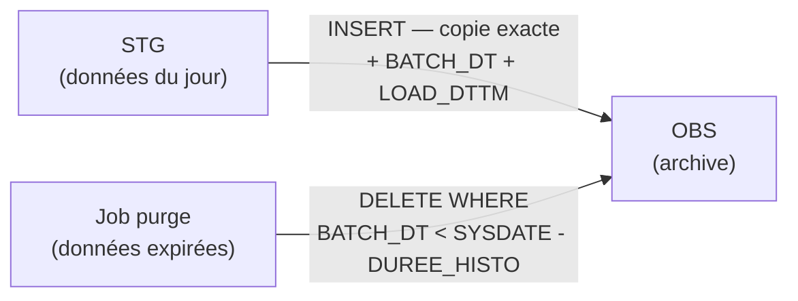

# Couche OBS — Observation (Archive)

## Rôle

L'OBS est l'**archive brute** des données reçues depuis les fichiers sources.
Elle répond à la question : *« Que nous a exactement envoyé le système source ce jour-là ? »*

Chaque batch quotidien est conservé tel quel — aucune transformation, aucun filtre.

### Pourquoi c'est indispensable

| Besoin             | Ce que l'OBS permet                                                                            |
| ------------------ | ---------------------------------------------------------------------------------------------- |
| **Rejeu de batch** | Si un bug est détecté dans WRK ou SOC, on repart de l'OBS sans redemander les fichiers sources |
| **Audit**          | Preuve de ce qui a été reçu à une date donnée (conformité, litige)                             |
| **Débogage**       | Comparer ce qui était dans STG avec ce qui est arrivé dans SOC                                 |
| **RGPD**           | Traçabilité de l'origine de chaque donnée personnelle                                          |

### Durée d'historisation (`DUREE_HISTO`)

La rétention OBS est **configurable par table** selon la sensibilité des données :

| Table                          | Durée recommandée | Raison                                  |
| ------------------------------ | ----------------- | --------------------------------------- |
| PATIENT, CONSULTATION          | 13 mois           | Données médicales — recouvrement annuel |
| TRAITEMENT, HOSPITALISATION    | 13 mois           | Idem                                    |
| CHAMBRE, MEDICAMENT, PERSONNEL | 3 mois            | Référentiels — changent peu             |

Les lignes expirées sont purgées par un job Airflow dédié (`purge_obs`).

---

## Structure des tables OBS

Chaque table OBS = table STG correspondante **+ 3 colonnes d'audit** :

| Colonne ajoutée | Type      | Description                                         |
| --------------- | --------- | --------------------------------------------------- |
| `BATCH_DT`      | DATE      | Date du batch source (`YYYYMMDD` du nom de fichier) |
| `LOAD_DTTM`     | TIMESTAMP | Horodatage du chargement dans OBS                   |
| `EXEC_ID`       | INTEGER   | FK → `TCH.T_SUIV_TRMT.EXEC_ID`                      |

La PK OBS = **PK source + `BATCH_DT`** (une ligne par batch, pas de déduplication).

---

## Diagramme — tables OBS

```mermaid
erDiagram
    OBS_CHAMBRE {
        INTEGER  NO_CHAMBRE   PK "PK source"
        DATE     BATCH_DT     PK "Date du batch"
        VARCHAR  NOM_CHAMBRE
        BYTEINT  NO_ETAGE
        VARCHAR  NOM_BATIMENT
        VARCHAR  TYPE_CHAMBRE
        SMALLINT PRIX_JOUR
        DATE     DT_CREATION
        TIMESTAMP LOAD_DTTM      "Horodatage chargement OBS"
        INTEGER  EXEC_ID         "FK TCH"
    }

    OBS_MEDICAMENT {
        VARCHAR  CD_MEDICAMENT  PK "Code medicament"
        VARCHAR  CATG_MEDICAMENT PK "Categorie"
        VARCHAR  MARQUE_FABRI   PK "Marque"
        DATE     BATCH_DT       PK "Date du batch"
        VARCHAR  NOM_MEDICAMENT
        VARCHAR  CONDIT_MEDICAMENT
        TIMESTAMP LOAD_DTTM
        INTEGER  EXEC_ID
    }

    OBS_PERSONNEL {
        INTEGER    ID_PERSONNEL  PK "PK source"
        DATE       BATCH_DT      PK "Date du batch"
        VARCHAR    NOM_PERSONNEL
        VARCHAR    PRENOM_PERSONNEL
        VARCHAR    FONCTION_PERSONNEL
        TIMESTAMP  TS_DEBUT_ACTIVITE
        TIMESTAMP  TS_FIN_ACTIVITE
        VARCHAR    RAISON_FIN_ACTIVITE
        TIMESTAMP  TS_CREATION_PERSONNEL
        TIMESTAMP  TS_MAJ_PERSONNEL
        VARCHAR    CD_STATUT_PERSONNEL
        TIMESTAMP  LOAD_DTTM
        INTEGER    EXEC_ID
    }

    OBS_PATIENT {
        INTEGER    ID_PATIENT    PK "PK source"
        DATE       BATCH_DT      PK "Date du batch"
        VARCHAR    NOM_PATIENT
        VARCHAR    PRENOM_PATIENT
        DATE       DT_NAISS
        VARCHAR    VILLE_NAISS
        VARCHAR    PAYS_NAISS
        VARCHAR    NUM_SECU
        VARCHAR    IND_PAYS_NUM_TELP
        VARCHAR    NUM_TELEPHONE
        VARCHAR    NUM_VOIE
        VARCHAR    DSC_VOIE
        VARCHAR    CMPL_VOIE
        VARCHAR    CD_POSTAL
        VARCHAR    VILLE
        VARCHAR    PAYS
        TIMESTAMP  TS_CREATION_PATIENT
        TIMESTAMP  TS_MAJ_PATIENT
        TIMESTAMP  LOAD_DTTM
        INTEGER    EXEC_ID
    }

    OBS_CONSULTATION {
        INTEGER    ID_CONSULT    PK "PK source"
        DATE       BATCH_DT      PK "Date du batch"
        INTEGER    ID_PERSONNEL
        INTEGER    ID_PATIENT
        TIMESTAMP  TS_DEBUT_CONSULT
        TIMESTAMP  TS_FIN_CONSULT
        INTEGER    POIDS_PATIENT
        INTEGER    TEMP_PATIENT
        VARCHAR    UNIT_TEMP
        INTEGER    TENSION_PATIENT
        VARCHAR    DSC_PATHO
        VARCHAR    INDIC_DIABETE
        INTEGER    ID_TRAITEMENT
        VARCHAR    INDIC_HOSPI
        TIMESTAMP  LOAD_DTTM
        INTEGER    EXEC_ID
    }

    OBS_TRAITEMENT {
        INTEGER    ID_TRAITEMENT  PK "PK source"
        DATE       BATCH_DT       PK "Date du batch"
        INTEGER    CD_MEDICAMENT
        VARCHAR    CATG_MEDICAMENT
        VARCHAR    MARQUE_FABRI
        SMALLINT   QTE_MEDICAMENT
        VARCHAR    DSC_POSOLOGIE
        INTEGER    ID_CONSULT
        TIMESTAMP  TS_CREATION_TRAITEMENT
        TIMESTAMP  LOAD_DTTM
        INTEGER    EXEC_ID
    }

    OBS_HOSPITALISATION {
        INTEGER    ID_HOSPI      PK "PK source"
        DATE       BATCH_DT      PK "Date du batch"
        INTEGER    ID_CONSULT
        SMALLINT   NO_CHAMBRE
        TIMESTAMP  TS_DEBUT_HOSPI
        TIMESTAMP  TS_FIN_HOSPI
        DECIMAL    COUT_HOSPI
        INTEGER    ID_PERSONNEL_RESP
        TIMESTAMP  LOAD_DTTM
        INTEGER    EXEC_ID
    }
```



---

## Flux de données



---

## Implémentation dbt

Les modèles OBS sont dans `dbt/models/intermediate/obs/`.
Matérialisation : **table** (append — on n'écrase jamais l'OBS).

```sql
-- Exemple : models/intermediate/obs/obs_patient.sql
{{ config(
    materialized='incremental',
    unique_key=['ID_PATIENT', 'BATCH_DT'],
    schema='obs'
) }}

SELECT
    ID_PATIENT,
    NOM_PATIENT,
    PRENOM_PATIENT,
    -- ... toutes les colonnes STG ...
    '{{ var("batch_date") }}'::DATE  AS BATCH_DT,
    CURRENT_TIMESTAMP()              AS LOAD_DTTM,
    {{ var("exec_id") }}             AS EXEC_ID
FROM {{ source('stg', 'patient') }}
```
