# Étape 2 — Socle (SOC)

Transformation du schéma **STG** vers le schéma **SOC** (couche de socle).
Référence : `inputs/Hopital Mapping VF.xlsx` (onglet *Socle*).

---

## Conventions de nommage

| Préfixe | Signification | Rôle |
|---|---|---|
| `R_` | Reference | Table de référence avec surrogate key |
| `O_` | Occurrence | Table de faits / événements |

> **Règle surrogate key** : `PART_ID` (R_PART) et `MEDC_ID` (R_MEDC) sont des séquences
> incrémentales calculées sur les valeurs métier uniques. Ne **jamais** utiliser `IDENTITY` Snowflake.

> **EXEC_ID** : toutes les tables SOC portent un `EXEC_ID` qui référence `T_SUIV_TRMT.EXEC_ID`
> pour la traçabilité pipeline (voir [03-technique.md](03-technique.md)).

---

## Party Model — R_PART

`R_PART` est le référentiel unifié des **tiers** : patients et personnel sont traités
comme des entités de même nature avec une clé commune `PART_ID`.

| Source STG | SRC_ID | SRC_TYP |
|---|---|---|
| `PATIENT.ID_PATIENT` | valeur de `ID_PATIENT` | `'Patient'` |
| `PERSONNEL.ID_PERSONNEL` | valeur de `ID_PERSONNEL` | valeur de `FONCTION_PERSONNEL` |

---

## Diagramme ERD — couche SOC

```mermaid
erDiagram
    R_PART {
        INTEGER  PART_ID  PK "Surrogate key tiers"
        INTEGER  SRC_ID      "ID source PATIENT ou PERSONNEL"
        VARCHAR  SRC_TYP     "Type Patient ou FONCTION_PERSONNEL"
    }

    R_ROOM {
        INTEGER  ROOM_NUM       PK "Numero de chambre"
        VARCHAR  ROOM_NAME         "Nom de la chambre"
        BYTEINT  FLOR_NUM          "Numero etage"
        VARCHAR  BULD_NAME         "Nom du batiment"
        VARCHAR  ROOM_TYP          "Type simple double"
        SMALLINT ROOM_DAY_RATE     "Tarif journalier"
        DATE     CRTN_DT           "Date de creation"
        INTEGER  EXEC_ID           "ID execution pipeline"
    }

    R_MEDC {
        INTEGER  MEDC_ID    PK "Surrogate key medicament"
        VARCHAR  MEDC_CD       "Code medicament"
        VARCHAR  MEDC_NAME     "Nom du medicament"
        VARCHAR  MEDC_COND     "Conditionnement"
        VARCHAR  MEDC_CATG     "Categorie"
        VARCHAR  MANF_BRND     "Marque fabricant"
        INTEGER  EXEC_ID       "ID execution pipeline"
    }

    O_INDV {
        INTEGER    PART_ID       PK "FK vers R_PART personnel et patient"
        VARCHAR    INDV_NAME        "Nom"
        VARCHAR    INDV_FIRS_NAME   "Prenom"
        VARCHAR    INDV_STTS_CD     "Statut individu"
        TIMESTAMP  CRTN_DTTM        "Date heure creation"
        TIMESTAMP  UPDT_DTTM        "Date heure mise a jour"
        DATE       BIRT_DT          "Date de naissance patient"
        VARCHAR    BIRT_CITY        "Ville de naissance patient"
        VARCHAR    BIRT_CNTR        "Pays de naissance patient"
        VARCHAR    SOCL_NUM         "Numero securite sociale patient"
        INTEGER    EXEC_ID          "ID execution pipeline"
    }

    O_STFF {
        INTEGER    PART_ID        PK "FK vers R_PART personnel uniquement"
        TIMESTAMP  WORK_STRT_DTTM    "Debut activite hopital"
        TIMESTAMP  WORK_END_DTTM     "Fin activite hopital"
        VARCHAR    WORK_END_RESN     "Raison fin activite"
        INTEGER    EXEC_ID           "ID execution pipeline"
    }

    O_TELP {
        INTEGER    PART_ID        PK "FK vers R_PART patient"
        TIMESTAMP  STRT_VALD_DTTM PK "Debut validite numero"
        VARCHAR    CNTR_IND          "Indicatif pays"
        VARCHAR    TELP_NUM          "Numero de telephone"
        TIMESTAMP  END_VALD_DTTM     "Fin validite numero"
        INTEGER    EXEC_ID           "ID execution pipeline"
    }

    O_ADDR {
        INTEGER    PART_ID        PK "FK vers R_PART patient"
        TIMESTAMP  STRT_VALD_DTTM PK "Debut validite adresse"
        VARCHAR    STRT_NUM          "Numero de voie"
        VARCHAR    STRT_DSC          "Libelle de voie"
        VARCHAR    COMP_STRT         "Complement adresse"
        VARCHAR    POST_CD           "Code postal"
        VARCHAR    CITY_NAME         "Ville"
        VARCHAR    CNTR_NAME         "Pays"
        TIMESTAMP  END_VALD_DTTM     "Fin validite adresse"
        INTEGER    EXEC_ID           "ID execution pipeline"
    }

    O_CONS {
        INTEGER    CONS_ID        PK "Identifiant consultation"
        INTEGER    STFF_ID        FK "FK vers R_PART medecin"
        INTEGER    PATN_ID        FK "FK vers R_PART patient"
        TIMESTAMP  CONS_STRT_DTTM    "Debut consultation"
        TIMESTAMP  CONS_END_DTTM     "Fin consultation"
        INTEGER    PATN_WEGH         "Poids patient kg"
        INTEGER    PATN_TEMP         "Temperature patient"
        VARCHAR    TEMP_UNIT         "Unite temperature C ou F"
        INTEGER    BLD_PRSS          "Tension arterielle"
        VARCHAR    PATH_DSC          "Description pathologie"
        BYTEINT    DIBT_IND          "Indicateur diabete 0 ou 1"
        INTEGER    TRET_ID        FK "FK vers O_TRET"
        BYTEINT    HOSP_IND          "Indicateur hospitalisation 0 ou 1"
        INTEGER    EXEC_ID           "ID execution pipeline"
    }

    O_TRET {
        INTEGER    TRET_ID        PK "Identifiant traitement"
        INTEGER    MEDC_ID        FK "FK vers R_MEDC"
        SMALLINT   MEDC_QTY          "Quantite medicament"
        VARCHAR    DOSG_DSC          "Description posologie"
        INTEGER    CONS_ID        FK "FK vers O_CONS"
        TIMESTAMP  TRET_CRTN_DTTM   "Date heure creation"
        INTEGER    EXEC_ID           "ID execution pipeline"
    }

    O_HOSP {
        INTEGER    HOSP_ID        PK "Identifiant hospitalisation"
        INTEGER    CONS_ID        FK "FK vers O_CONS"
        SMALLINT   ROOM_NUM       FK "FK vers R_ROOM"
        TIMESTAMP  HOSP_STRT_DTTM   "Debut hospitalisation"
        TIMESTAMP  HOSP_END_DTTM    "Fin hospitalisation"
        DECIMAL    HOSP_FINL_RATE   "Cout total hospitalisation"
        INTEGER    STFF_ID        FK "FK vers R_PART responsable"
        INTEGER    EXEC_ID           "ID execution pipeline"
    }

    R_PART ||--o{ O_INDV : "decrit nom et prenom"
    R_PART ||--o| O_STFF : "est membre du personnel"
    R_PART ||--o{ O_TELP : "possede un telephone"
    R_PART ||--o{ O_ADDR : "possede une adresse"
    R_PART ||--o{ O_CONS : "est patient de"
    R_PART ||--o{ O_CONS : "est medecin de"
    R_PART ||--o{ O_HOSP : "est responsable de"
    R_MEDC ||--o{ O_TRET : "utilise dans traitement"
    O_CONS ||--o{ O_TRET : "prescrit traitement"
    O_CONS ||--o| O_HOSP : "declenche hospitalisation"
    R_ROOM ||--o{ O_HOSP : "accueille patient"
```

---

## Mapping détaillé par table SOC

### R_ROOM — depuis STG_CHAMBRE

| Colonne STG | Colonne SOC | Règle |
|---|---|---|
| `NO_CHAMBRE` | `ROOM_NUM` PK | Alimentation directe |
| `NOM_CHAMBRE` | `ROOM_NAME` | Alimentation directe |
| `NO_ETAGE` | `FLOR_NUM` | Alimentation directe |
| `NOM_BATIMENT` | `BULD_NAME` | Alimentation directe |
| `TYPE_CHAMBRE` | `ROOM_TYP` | Alimentation directe |
| `PRIX_JOUR` | `ROOM_DAY_RATE` | Alimentation directe |
| `DT_CREATION` | `CRTN_DT` | Alimentation directe |
| *(pipeline)* | `EXEC_ID` | ID exécution en cours |

### R_MEDC — depuis STG_MEDICAMENT

| Colonne STG | Colonne SOC | Règle |
|---|---|---|
| *(généré)* | `MEDC_ID` PK | Surrogate key sur `(CD_MEDICAMENT, CATG_MEDICAMENT, MARQUE_FABRI)` |
| `CD_MEDICAMENT` | `MEDC_CD` | Alimentation directe |
| `NOM_MEDICAMENT` | `MEDC_NAME` | Alimentation directe |
| `CONDIT_MEDICAMENT` | `MEDC_COND` | Alimentation directe |
| `CATG_MEDICAMENT` | `MEDC_CATG` | Alimentation directe |
| `MARQUE_FABRI` | `MANF_BRND` | Alimentation directe |
| *(pipeline)* | `EXEC_ID` | ID exécution en cours |

### R_PART — depuis STG_PATIENT et STG_PERSONNEL

| Source | Colonne STG | Colonne SOC | Règle |
|---|---|---|---|
| PERSONNEL | `ID_PERSONNEL` | `SRC_ID` | Alimentation directe |
| PERSONNEL | `FONCTION_PERSONNEL` | `SRC_TYP` | Alimentation directe |
| PATIENT | `ID_PATIENT` | `SRC_ID` | Alimentation directe |
| PATIENT | *(fixe)* | `SRC_TYP` | Valeur constante `'Patient'` |
| — | *(généré)* | `PART_ID` PK | Surrogate key sur `(SRC_ID, SRC_TYP)` |

### O_INDV — depuis STG_PERSONNEL et STG_PATIENT

| Source | Colonne STG | Colonne SOC | Règle |
|---|---|---|---|
| PERSONNEL | `ID_PERSONNEL + FONCTION` | `PART_ID` PK | Lookup R_PART sur `(SRC_ID, SRC_TYP)` |
| PERSONNEL | `NOM_PERSONNEL` | `INDV_NAME` | Alimentation directe |
| PERSONNEL | `PRENOM_PERSONNEL` | `INDV_FIRS_NAME` | Alimentation directe |
| PERSONNEL | `CD_STATUT_PERSONNEL` | `INDV_STTS_CD` | Alimentation directe |
| PERSONNEL | `TS_CREATION_PERSONNEL` | `CRTN_DTTM` | Alimentation directe |
| PERSONNEL | `TS_MAJ_PERSONNEL` | `UPDT_DTTM` | Alimentation directe |
| PATIENT | `ID_PATIENT` | `PART_ID` PK | Lookup R_PART sur `(ID_PATIENT, 'Patient')` |
| PATIENT | `NOM_PATIENT` | `INDV_NAME` | Alimentation directe |
| PATIENT | `PRENOM_PATIENT` | `INDV_FIRS_NAME` | Alimentation directe |
| PATIENT | *(fixe)* | `INDV_STTS_CD` | Valeur constante `'Actif'` |
| PATIENT | `TS_CREATION_PATIENT` | `CRTN_DTTM` | Alimentation directe |
| PATIENT | `TS_MAJ_PATIENT` | `UPDT_DTTM` | Alimentation directe |
| PATIENT | `DT_NAISS` | `BIRT_DT` | Alimentation directe |
| PATIENT | `VILLE_NAISS` | `BIRT_CITY` | Alimentation directe |
| PATIENT | `PAYS_NAISS` | `BIRT_CNTR` | Alimentation directe |
| PATIENT | `NUM_SECU` | `SOCL_NUM` | Alimentation directe |

### O_STFF — depuis STG_PERSONNEL

| Colonne STG | Colonne SOC | Règle |
|---|---|---|
| `ID_PERSONNEL + FONCTION` | `PART_ID` PK | Lookup R_PART |
| `TS_DEBUT_ACTIVITE` | `WORK_STRT_DTTM` | Alimentation directe |
| `TS_FIN_ACTIVITE` | `WORK_END_DTTM` | Alimentation directe |
| `RAISON_FIN_ACTIVITE` | `WORK_END_RESN` | Alimentation directe |
| *(pipeline)* | `EXEC_ID` | ID exécution en cours |

### O_TELP — depuis STG_PATIENT

| Colonne STG | Colonne SOC | Règle |
|---|---|---|
| `ID_PATIENT` | `PART_ID` PK | Lookup R_PART sur `(ID_PATIENT, 'Patient')` |
| `IND_PAYS_NUM_TELP` | `CNTR_IND` | Alimentation directe |
| `NUM_TELEPHONE` | `TELP_NUM` | Alimentation directe |
| `TS_CREATION_PATIENT` | `STRT_VALD_DTTM` PK | Alimentation directe |
| `TS_MAJ_PATIENT` | `END_VALD_DTTM` | Alimentation directe |
| *(pipeline)* | `EXEC_ID` | ID exécution en cours |

### O_ADDR — depuis STG_PATIENT

| Colonne STG | Colonne SOC | Règle |
|---|---|---|
| `ID_PATIENT` | `PART_ID` PK | Lookup R_PART sur `(ID_PATIENT, 'Patient')` |
| `NUM_VOIE` | `STRT_NUM` | Alimentation directe |
| `DSC_VOIE` | `STRT_DSC` | Alimentation directe |
| `CMPL_VOIE` | `COMP_STRT` | Alimentation directe |
| `CD_POSTAL` | `POST_CD` | Alimentation directe |
| `VILLE` | `CITY_NAME` | Alimentation directe |
| `PAYS` | `CNTR_NAME` | Alimentation directe |
| `TS_CREATION_PATIENT` | `STRT_VALD_DTTM` PK | Alimentation directe |
| `TS_MAJ_PATIENT` | `END_VALD_DTTM` | Alimentation directe |
| *(pipeline)* | `EXEC_ID` | ID exécution en cours |

### O_CONS — depuis STG_CONSULTATION

| Colonne STG | Colonne SOC | Règle |
|---|---|---|
| `ID_CONSULT` | `CONS_ID` PK | Alimentation directe |
| `ID_PERSONNEL` | `STFF_ID` | Lookup R_PART sur `(ID_PERSONNEL, SRC_TYP != 'Patient')` |
| `ID_PATIENT` | `PATN_ID` | Lookup R_PART sur `(ID_PATIENT, 'Patient')` |
| `TS_DEBUT_CONSULT` | `CONS_STRT_DTTM` | Alimentation directe |
| `TS_FIN_CONSULT` | `CONS_END_DTTM` | Alimentation directe |
| `POIDS_PATIENT` | `PATN_WEGH` | Alimentation directe |
| `TEMP_PATIENT` | `PATN_TEMP` | Alimentation directe |
| `UNIT_TEMP` | `TEMP_UNIT` | Alimentation directe |
| `TENSION_PATIENT` | `BLD_PRSS` | Alimentation directe |
| `DSC_PATHO` | `PATH_DSC` | Alimentation directe |
| `INDIC_DIABETE` | `DIBT_IND` | `'True'` → 1, sinon 0 |
| `ID_TRAITEMENT` | `TRET_ID` | Alimentation directe |
| `INDIC_HOSPI` | `HOSP_IND` | `'True'` → 1, sinon 0 |
| *(pipeline)* | `EXEC_ID` | ID exécution en cours |

### O_TRET — depuis STG_TRAITEMENT

| Colonne STG | Colonne SOC | Règle |
|---|---|---|
| `ID_TRAITEMENT` | `TRET_ID` PK | Alimentation directe |
| `CD_MEDICAMENT + CATG + MARQUE` | `MEDC_ID` | Lookup R_MEDC sur les 3 colonnes |
| `QTE_MEDICAMENT` | `MEDC_QTY` | Alimentation directe |
| `DSC_POSOLOGIE` | `DOSG_DSC` | Alimentation directe |
| `ID_CONSULT` | `CONS_ID` | Alimentation directe |
| `TS_CREATION_TRAITEMENT` | `TRET_CRTN_DTTM` | Alimentation directe |
| *(pipeline)* | `EXEC_ID` | ID exécution en cours |

### O_HOSP — depuis STG_HOSPITALISATION

| Colonne STG | Colonne SOC | Règle |
|---|---|---|
| `ID_HOSPI` | `HOSP_ID` PK | Alimentation directe |
| `ID_CONSULT` | `CONS_ID` | Alimentation directe |
| `NO_CHAMBRE` | `ROOM_NUM` | Alimentation directe |
| `TS_DEBUT_HOSPI` | `HOSP_STRT_DTTM` | Alimentation directe |
| `TS_FIN_HOSPI` | `HOSP_END_DTTM` | Alimentation directe |
| `COUT_HOSPI` | `HOSP_FINL_RATE` | Alimentation directe — type `DECIMAL(10,2)` |
| `ID_PERSONNEL_RESP` | `STFF_ID` | Lookup R_PART sur `(ID_PERSONNEL_RESP, SRC_TYP != 'Patient')` |
| *(pipeline)* | `EXEC_ID` | ID exécution en cours |

---

## Corrections par rapport au fichier Excel

| Table | Colonne | Type Excel | Type correct | Raison |
|---|---|---|---|---|
| `O_HOSP` | `HOSP_FINL_RATE` | `TIMESTAMP(0)` | `DECIMAL(10,2)` | C'est un montant financier, pas une date |
| `O_CONS` | `TRET_ID` | `TIMESTAMP(0)` | `INTEGER` | C'est un identifiant entier, pas une date |
| `STG_HOSPITALISATION` | `COUT_HOSPI` | `DATETIME` | `DECIMAL(10,2)` | Même raison |
