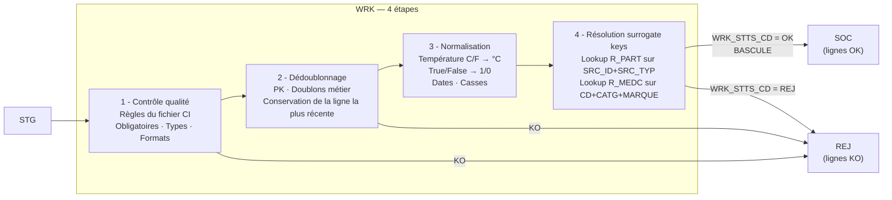

# Couche WRK — Work / Travail

## Rôle

Le WRK est l'**atelier de transformation** : c'est là que les données brutes deviennent
exploitables. Il répond à la question : *« Ces données sont-elles correctes et cohérentes ? »*

Le WRK n'est **jamais exposé directement** à Power BI. Il sert de zone de travail :
les données validées (`WRK_STTS_CD = 'OK'`) basculent vers SOC ;
les données invalides (`WRK_STTS_CD = 'REJ'`) partent vers REJ.

---

## Les 4 étapes séquentielles



---

## Colonnes de contrôle ajoutées

Chaque table WRK contient les colonnes source STG **+ les colonnes de contrôle** :

| Colonne       | Type         | Valeurs               | Description                         |
| ------------- | ------------ | --------------------- | ----------------------------------- |
| `WRK_STTS_CD` | VARCHAR(3)   | `OK` / `REJ` / `ENC`  | Statut de la ligne après traitement |
| `REJ_COD`     | VARCHAR(20)  | voir table ci-dessous | Code motif de rejet (null si OK)    |
| `REJ_DSC`     | VARCHAR(500) | texte libre           | Description détaillée du rejet      |
| `BATCH_DT`    | DATE         | —                     | Date du batch en cours              |
| `EXEC_ID`     | INTEGER      | —                     | FK → `TCH.T_SUIV_TRMT`              |

### Codes de rejet (`REJ_COD`)

| Code             | Étape             | Description                                                     |
| ---------------- | ----------------- | --------------------------------------------------------------- |
| `NULL_MANDATORY` | 1 - Qualité       | Colonne obligatoire nulle ou vide                               |
| `WRONG_TYPE`     | 1 - Qualité       | Type de donnée incorrect (ex. texte dans un INTEGER)            |
| `WRONG_FORMAT`   | 1 - Qualité       | Format invalide (ex. date hors plage, indicatif téléphone)      |
| `DUPLICATE_PK`   | 2 - Dédup         | Doublon sur la clé primaire métier                              |
| `FK_NOT_FOUND`   | 4 - SK            | Clé étrangère introuvable dans la table de référence            |
| `NORM_FAILURE`   | 3 - Normalisation | Valeur impossible à normaliser (ex. unité température inconnue) |

---

## Règles de qualité par table (depuis `Hopital CI VF.xlsx`)

### CHAMBRE — chargement full

| Colonne       | Obligatoire | Règle                   |
| ------------- | ----------- | ----------------------- |
| `NO_CHAMBRE`  | Oui (PK)    | Non nul, entier positif |
| `NOM_CHAMBRE` | Oui         | Non nul                 |
| `PRIX_JOUR`   | Oui         | Non nul, > 0            |
| `DT_CREATION` | Oui         | Date valide             |

### MEDICAMENT — chargement full

| Colonne           | Obligatoire | Règle   |
| ----------------- | ----------- | ------- |
| `CD_MEDICAMENT`   | Oui (PK)    | Non nul |
| `CATG_MEDICAMENT` | Oui (PK)    | Non nul |
| `MARQUE_FABRI`    | Oui (PK)    | Non nul |

### PERSONNEL — chargement full

| Colonne                 | Obligatoire | Règle                   |
| ----------------------- | ----------- | ----------------------- |
| `ID_PERSONNEL`          | Oui (PK)    | Non nul, entier positif |
| `NOM_PERSONNEL`         | Oui         | Non nul                 |
| `PRENOM_PERSONNEL`      | Oui         | Non nul                 |
| `FONCTION_PERSONNEL`    | Oui         | Non nul                 |
| `TS_DEBUT_ACTIVITE`     | Oui         | Timestamp valide        |
| `TS_CREATION_PERSONNEL` | Oui         | Timestamp valide        |
| `TS_MAJ_PERSONNEL`      | Oui         | Timestamp valide        |
| `CD_STATUT_PERSONNEL`   | Oui         | Non nul                 |

### PATIENT — chargement delta

| Colonne               | Obligatoire | Règle                   |
| --------------------- | ----------- | ----------------------- |
| `ID_PATIENT`          | Oui (PK)    | Non nul, entier positif |
| `NOM_PATIENT`         | Oui         | Non nul                 |
| `PRENOM_PATIENT`      | Oui         | Non nul                 |
| `TS_CREATION_PATIENT` | Oui         | Timestamp valide        |
| `TS_MAJ_PATIENT`      | Oui         | Timestamp valide        |

### CONSULTATION — chargement delta

| Colonne            | Obligatoire | Règle                                    |
| ------------------ | ----------- | ---------------------------------------- |
| `ID_CONSULT`       | Oui (PK)    | Non nul, entier positif                  |
| `ID_PERSONNEL`     | Oui         | Non nul, doit exister dans WRK_PERSONNEL |
| `ID_PATIENT`       | Oui         | Non nul, doit exister dans WRK_PATIENT   |
| `TS_DEBUT_CONSULT` | Oui         | Timestamp valide                         |
| `TS_FIN_CONSULT`   | Oui         | Timestamp valide, > `TS_DEBUT_CONSULT`   |
| `POIDS_PATIENT`    | Oui         | Non nul, > 0                             |
| `INDIC_DIABETE`    | —           | Si renseigné : `True` ou `False`         |
| `INDIC_HOSPI`      | —           | Si renseigné : `True` ou `False`         |

### TRAITEMENT — chargement delta

| Colonne                  | Obligatoire | Règle                                                                    |
| ------------------------ | ----------- | ------------------------------------------------------------------------ |
| `ID_TRAITEMENT`          | Oui (PK)    | Non nul                                                                  |
| `CD_MEDICAMENT`          | Oui         | Non nul, combinaison (CD, CATG, MARQUE) doit exister dans WRK_MEDICAMENT |
| `CATG_MEDICAMENT`        | Oui         | Non nul                                                                  |
| `MARQUE_FABRI`           | Oui         | Non nul                                                                  |
| `DSC_POSOLOGIE`          | Oui         | Non nul                                                                  |
| `ID_CONSULT`             | Oui         | Non nul, doit exister dans WRK_CONSULTATION                              |
| `TS_CREATION_TRAITEMENT` | Oui         | Timestamp valide                                                         |

### HOSPITALISATION — chargement delta

| Colonne             | Obligatoire | Règle                                                             |
| ------------------- | ----------- | ----------------------------------------------------------------- |
| `ID_HOSPI`          | Oui (PK)    | Non nul                                                           |
| `ID_CONSULT`        | Oui         | Non nul, doit exister dans WRK_CONSULTATION, `INDIC_HOSPI = True` |
| `NO_CHAMBRE`        | Oui         | Non nul, doit exister dans WRK_CHAMBRE                            |
| `TS_DEBUT_HOSPI`    | Oui         | Timestamp valide                                                  |
| `ID_PERSONNEL_RESP` | Oui         | Non nul, doit exister dans WRK_PERSONNEL                          |

---

## Normalisation (étape 3)

| Table        | Colonne STG                  | Transformation                             | Colonne WRK   |
| ------------ | ---------------------------- | ------------------------------------------ | ------------- |
| CONSULTATION | `TEMP_PATIENT` + `UNIT_TEMP` | Si `UNIT_TEMP = 'F'` : `(TEMP - 32) * 5/9` | `PATN_TEMP_C` |
| CONSULTATION | `INDIC_DIABETE`              | `'True'` → 1, sinon 0                      | `DIBT_IND`    |
| CONSULTATION | `INDIC_HOSPI`                | `'True'` → 1, sinon 0                      | `HOSP_IND`    |

---

## Implémentation dbt

Les modèles WRK sont dans `dbt/models/intermediate/wrk/`, matérialisation **table**.
Chaque modèle produit une table avec `WRK_STTS_CD` sur chaque ligne.

```sql
-- Exemple : models/intermediate/wrk/wrk_patient.sql
{{ config(materialized='table', schema='wrk') }}

WITH source AS (
    SELECT * FROM {{ source('stg', 'patient') }}
),

quality_check AS (
    SELECT
        *,
        CASE
            WHEN ID_PATIENT IS NULL            THEN 'REJ'
            WHEN NOM_PATIENT IS NULL           THEN 'REJ'
            WHEN PRENOM_PATIENT IS NULL        THEN 'REJ'
            WHEN TS_CREATION_PATIENT IS NULL   THEN 'REJ'
            ELSE 'OK'
        END AS WRK_STTS_CD,
        CASE
            WHEN ID_PATIENT IS NULL            THEN 'NULL_MANDATORY'
            WHEN NOM_PATIENT IS NULL           THEN 'NULL_MANDATORY'
            WHEN PRENOM_PATIENT IS NULL        THEN 'NULL_MANDATORY'
            WHEN TS_CREATION_PATIENT IS NULL   THEN 'NULL_MANDATORY'
            ELSE NULL
        END AS REJ_COD,
        '{{ var("batch_date") }}'::DATE AS BATCH_DT,
        {{ var("exec_id") }}            AS EXEC_ID
    FROM source
)

SELECT * FROM quality_check
```
