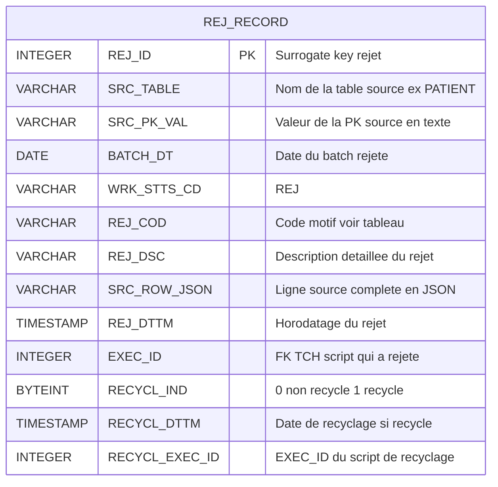
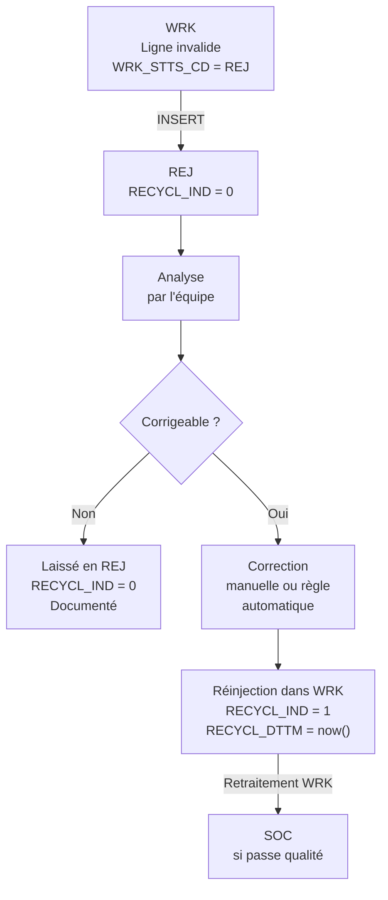

# Couche REJ — Rejet

## Rôle

REJ stocke les lignes qui ont **échoué** les contrôles qualité du WRK.
Il répond à la question : *« Que faire des données invalides reçues du système source ? »*

### Principes fondamentaux

- **On ne supprime jamais** : chaque ligne rejetée est conservée avec son motif
- **Traçabilité** : on sait exactement quel batch, quel script, quelle règle a rejeté la ligne
- **Recyclage** : après correction manuelle ou automatique, une ligne peut être réinjectée dans WRK

### Pourquoi ne pas simplement ignorer les erreurs ?

| Approche naïve | Approche REJ |
| --- | --- |
| Lignes invalides silencieusement ignorées | Toutes les erreurs sont visibles et quantifiées |
| Impossible de savoir combien de données sont perdues | KPI de qualité : taux de rejet par table / batch |
| Pas de correction possible | Correction + recyclage organisé |
| Audit impossible | Preuve de réception avec motif d'exclusion |

---

## Structure de la table REJ centrale

Une **table REJ unique** reçoit les rejets de toutes les sources, identifiées par `SRC_TABLE`.



> `SRC_ROW_JSON` contient la ligne complète sérialisée en JSON —
> permet de reconstruire la ligne originale sans retourner dans STG ou OBS.

---

## Codes de rejet

| Code | Étape WRK | Signification | Action corrective |
| --- | --- | --- | --- |
| `NULL_MANDATORY` | ① Qualité | Colonne obligatoire nulle | Demander correction au système source |
| `WRONG_TYPE` | ① Qualité | Valeur non castable vers le type cible | Vérifier le contrat d'interface |
| `WRONG_FORMAT` | ① Qualité | Format invalide (date, indicatif tel) | Règle de nettoyage ou correction source |
| `DUPLICATE_PK` | ② Dédup | Doublon sur PK — ligne conservée est la plus récente | Analyser pourquoi le source envoie des doublons |
| `FK_NOT_FOUND` | ④ SK | Clé étrangère absente de la référence | Vérifier l'ordre de chargement des tables |
| `NORM_FAILURE` | ③ Normalisation | Valeur impossible à normaliser | Ex. `UNIT_TEMP` ni `C` ni `F` |

---

## Cycle de vie d'un rejet



---

## Suivi et alertes

Le taux de rejet est un **KPI de qualité pipeline** à surveiller :

```sql
-- Taux de rejet par table et par batch
SELECT
    SRC_TABLE,
    BATCH_DT,
    COUNT(*)                                          AS nb_rejets,
    COUNT(*) FILTER (WHERE RECYCL_IND = 1)            AS nb_recycles,
    COUNT(*) FILTER (WHERE RECYCL_IND = 0)            AS nb_en_attente,
    REJ_COD,
    COUNT(*)                                          AS nb_par_code
FROM TCH.REJ_RECORD
GROUP BY SRC_TABLE, BATCH_DT, REJ_COD
ORDER BY BATCH_DT DESC, nb_rejets DESC;
```

Un taux de rejet > 5 % sur une table déclenche une alerte dans Airflow
(à configurer dans le DAG via un `ShortCircuitOperator` ou callback).

---

## Implémentation dbt

Le modèle REJ lit les lignes `WRK_STTS_CD = 'REJ'` de toutes les tables WRK
et les insère dans la table centrale REJ (matérialisation **incremental append**).

```sql
-- models/intermediate/rej/rej_record.sql
{{ config(
    materialized='incremental',
    unique_key='REJ_ID',
    schema='rej'
) }}

WITH rej_patient AS (
    SELECT
        {{ dbt_utils.generate_surrogate_key(['SRC_TABLE', 'SRC_PK_VAL', 'BATCH_DT', 'EXEC_ID']) }}
            AS REJ_ID,
        'PATIENT'                         AS SRC_TABLE,
        ID_PATIENT::VARCHAR               AS SRC_PK_VAL,
        BATCH_DT,
        'REJ'                             AS WRK_STTS_CD,
        REJ_COD,
        REJ_DSC,
        OBJECT_CONSTRUCT(*)::VARCHAR      AS SRC_ROW_JSON,
        CURRENT_TIMESTAMP()               AS REJ_DTTM,
        EXEC_ID,
        0                                 AS RECYCL_IND,
        NULL::TIMESTAMP                   AS RECYCL_DTTM,
        NULL::INTEGER                     AS RECYCL_EXEC_ID
    FROM {{ ref('wrk_patient') }}
    WHERE WRK_STTS_CD = 'REJ'
),

-- ... idem pour chaque table WRK ...

all_rejects AS (
    SELECT * FROM rej_patient
    -- UNION ALL rej_personnel
    -- UNION ALL rej_consultation
    -- ...
)

SELECT * FROM all_rejects
```
