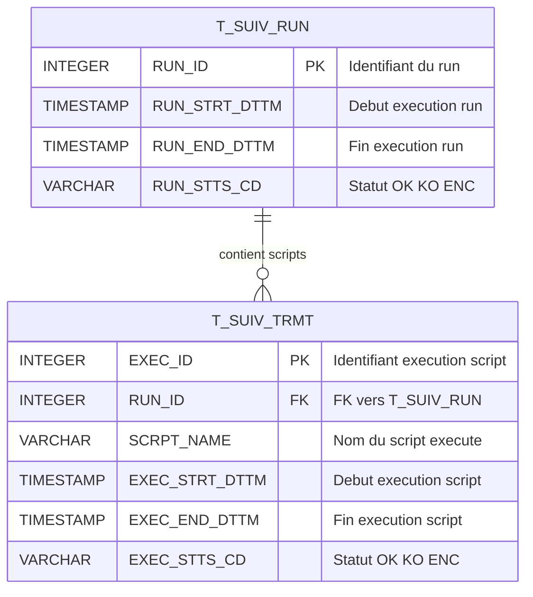
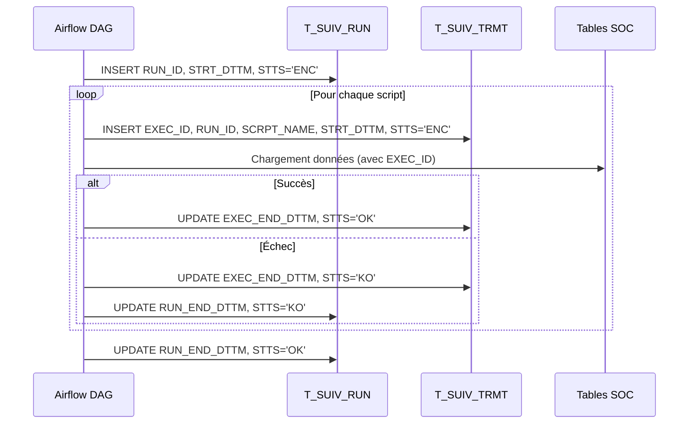

# Étape 3 — Tables techniques (TCH)

Tables de suivi du pipeline dans le schéma **TCH** de Snowflake.
Référence : `inputs/Hopital Mapping VF.xlsx` (onglet *Socle*, section TCH).

Ces tables permettent de tracer chaque exécution de la chaîne de traitement
et de chaque script individuel — indispensable pour le rejeu, le débogage et l'audit.

---

## Concepts

| Concept        | Table         | Description                                                       |
| -------------- | ------------- | ----------------------------------------------------------------- |
| **Run**        | `T_SUIV_RUN`  | Une exécution complète de la chaîne (tous les scripts d'un batch) |
| **Traitement** | `T_SUIV_TRMT` | Un script individuel à l'intérieur d'un run                       |

Un **run** contient un ou plusieurs **traitements** (scripts dbt, Airflow tasks, etc.).
Chaque ligne des tables SOC porte un `EXEC_ID` → `T_SUIV_TRMT.EXEC_ID`
pour savoir quel script a chargé cette ligne.

**Codes statut** : `OK` (succès), `KO` (échec), `ENC` (en cours).

---

## Diagramme ERD — couche TCH



---

## Mapping des colonnes

### T_SUIV_RUN

| Colonne         | Type         | Obligatoire | Description        | Règle d'alimentation                            |
| --------------- | ------------ | ----------- | ------------------ | ----------------------------------------------- |
| `RUN_ID`        | INTEGER      | Oui (PK)    | Identifiant du run | Séquence incrémentale au lancement de la chaîne |
| `RUN_STRT_DTTM` | TIMESTAMP(0) | Oui         | Début d'exécution  | Horodatage au démarrage                         |
| `RUN_END_DTTM`  | TIMESTAMP(0) | —           | Fin d'exécution    | Horodatage à la fin (null si en cours)          |
| `RUN_STTS_CD`   | VARCHAR(10)  | Oui         | Statut             | `ENC` au départ, puis `OK` ou `KO` à la fin     |

### T_SUIV_TRMT

| Colonne          | Type         | Obligatoire | Description                    | Règle d'alimentation                                |
| ---------------- | ------------ | ----------- | ------------------------------ | --------------------------------------------------- |
| `EXEC_ID`        | INTEGER      | Oui (PK)    | Identifiant d'exécution script | Séquence incrémentale au lancement de chaque script |
| `RUN_ID`         | INTEGER      | Oui (FK)    | Identifiant du run parent      | FK vers `T_SUIV_RUN.RUN_ID`                         |
| `SCRPT_NAME`     | VARCHAR(250) | Oui         | Nom du script                  | Nom du fichier ou de la tâche Airflow               |
| `EXEC_STRT_DTTM` | TIMESTAMP(0) | Oui         | Début d'exécution              | Horodatage au démarrage du script                   |
| `EXEC_END_DTTM`  | TIMESTAMP(0) | —           | Fin d'exécution                | Horodatage à la fin (null si en cours)              |
| `EXEC_STTS_CD`   | VARCHAR(10)  | Oui         | Statut                         | `ENC` au départ, puis `OK` ou `KO` à la fin         |

---

## Cycle de vie d'un run



---

## Lien avec les tables SOC

Chaque table de la couche SOC porte un `EXEC_ID` qui référence `T_SUIV_TRMT.EXEC_ID` :

```sql
-- Retrouver quand une ligne a été chargée et par quel script
SELECT
    o.CONS_ID,
    t.SCRPT_NAME,
    t.EXEC_STRT_DTTM,
    r.RUN_ID
FROM SOC.O_CONS o
JOIN TCH.T_SUIV_TRMT t ON o.EXEC_ID = t.EXEC_ID
JOIN TCH.T_SUIV_RUN  r ON t.RUN_ID  = r.RUN_ID
WHERE o.CONS_ID = 12345;
```
