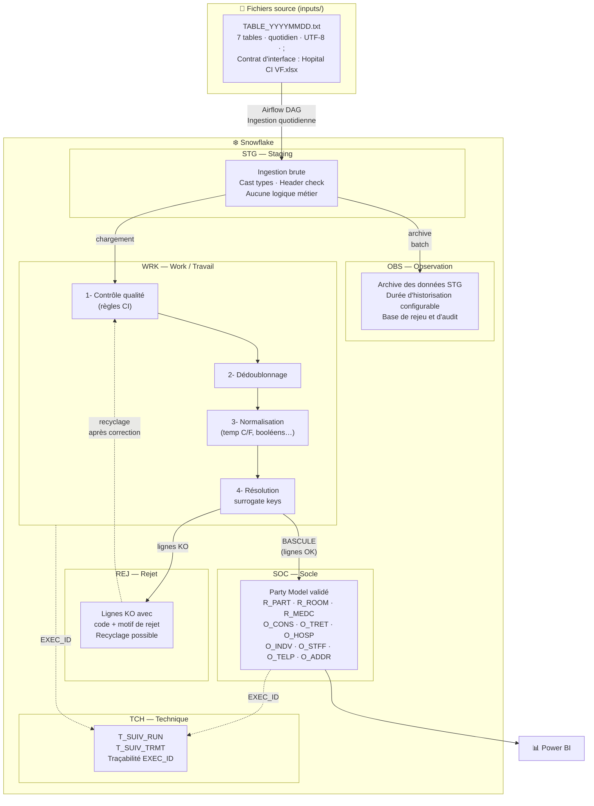

# Documentation technique — bi-platform

Source de vérité : `inputs/Hopital Mapping VF.xlsx` et `inputs/Hopital CI VF.xlsx`.

## Fichiers

| #   | Fichier                            | Couche  | Description                                     |
| --- | ---------------------------------- | ------- | ----------------------------------------------- |
| 1   | [01-staging.md](01-staging.md)     | **STG** | Ingestion des fichiers plats → Snowflake        |
| 2   | [02-obs.md](02-obs.md)             | **OBS** | Archive brute des données STG (historisation)   |
| 3   | [03-wrk.md](03-wrk.md)             | **WRK** | Travail : qualité, dédoublonnage, normalisation |
| 4   | [04-rej.md](04-rej.md)             | **REJ** | Rejets de qualité et recyclage                  |
| 5   | [05-socle.md](05-socle.md)         | **SOC** | Socle final (Party Model) après bascule         |
| 6   | [06-technique.md](06-technique.md) | **TCH** | Suivi pipeline run / script                     |

---

## Architecture globale

---

## Rôle de chaque couche

| Couche  | Question clé                                      | Ce qu'elle répond                                               |
| ------- | ------------------------------------------------- | --------------------------------------------------------------- |
| **STG** | _Qu'est-ce que le système source nous a envoyé ?_ | Copie exacte des fichiers plats, typée                          |
| **OBS** | _Peut-on rejouer un batch passé ?_                | Archive horodatée, durée de rétention configurable              |
| **WRK** | _Ces données sont-elles exploitables ?_           | Qualité, dédup, normalisation — seules les lignes OK continuent |
| **REJ** | _Que faire des données mauvaises ?_               | Stockage avec motif, possibilité de correction et recyclage     |
| **SOC** | _Quel est l'état de référence validé ?_           | Party Model propre, prêt pour Power BI                          |
| **TCH** | _Qui a chargé cette ligne et quand ?_             | Traçabilité complète de chaque exécution                        |

---

## Mapping couches ↔ dbt

| Couche Snowflake | Couche dbt                 | Matérialisation                     |
| ---------------- | -------------------------- | ----------------------------------- |
| STG              | `models/staging/`          | view                                |
| OBS              | `models/intermediate/obs/` | table (partitionnée par batch_date) |
| WRK              | `models/intermediate/wrk/` | table                               |
| REJ              | `models/intermediate/rej/` | table (append)                      |
| SOC              | `models/marts/`            | table                               |
