# Documentation technique — bi-platform

Source de vérité : `inputs/Hopital Mapping VF.xlsx` et `inputs/Hopital CI VF.xlsx`.

## Fichiers

| Fichier | Couche | Description |
|---|---|---|
| [01-staging.md](01-staging.md) | **STG** | Fichiers source → tables de staging Snowflake |
| [02-socle.md](02-socle.md) | **SOC** | Staging → tables de socle (Party Model) |
| [03-technique.md](03-technique.md) | **TCH** | Tables de suivi pipeline (run / script) |

## Architecture globale

```mermaid
flowchart LR
    subgraph SRC["Fichiers source (inputs/)"]
        direction TB
        F1[CHAMBRE_YYYYMMDD.txt]
        F2[PATIENT_YYYYMMDD.txt]
        F3[PERSONNEL_YYYYMMDD.txt]
        F4[MEDICAMENT_YYYYMMDD.txt]
        F5[CONSULTATION_YYYYMMDD.txt]
        F6[TRAITEMENT_YYYYMMDD.txt]
        F7[HOSPITALISATION_YYYYMMDD.txt]
    end

    subgraph STG["Snowflake — Staging (STG)"]
        direction TB
        S1[CHAMBRE]
        S2[PATIENT]
        S3[PERSONNEL]
        S4[MEDICAMENT]
        S5[CONSULTATION]
        S6[TRAITEMENT]
        S7[HOSPITALISATION]
    end

    subgraph SOC["Snowflake — Socle (SOC)"]
        direction TB
        R1[R_PART]
        R2[R_ROOM]
        R3[R_MEDC]
        O1[O_INDV]
        O2[O_STFF]
        O3[O_TELP]
        O4[O_ADDR]
        O5[O_CONS]
        O6[O_TRET]
        O7[O_HOSP]
    end

    subgraph TCH["Snowflake — Technique (TCH)"]
        T1[T_SUIV_RUN]
        T2[T_SUIV_TRMT]
    end

    subgraph PBI["Power BI"]
        D[Dashboards]
    end

    SRC -->|"Airflow + dbt\nchargement quotidien"| STG
    STG -->|"dbt\ntransformation"| SOC
    SOC --> PBI
    SOC -.->|"EXEC_ID"| TCH
```

