# MPD — Modèle Physique de Données (Socle)

Schéma de la couche **Socle** (`SOC`) et des tables techniques (`TCH`), tel que défini dans
`inputs/Hopital Mapping VF.xlsx` (onglet *Socle*).

## Conventions de nommage

| Préfixe | Signification | Rôle |
|---|---|---|
| `R_` | Reference | Table de référence / dimension (lookup, surrogate key) |
| `O_` | Occurrence | Table de faits / événements (données transactionnelles) |
| `T_` | Technical | Table technique de suivi pipeline |

> **Surrogate keys** : les `PART_ID` (R_PART) et `MEDC_ID` (R_MEDC) sont des séquences
> incrémentales calculées sur les valeurs métier — **pas** de `IDENTITY` automatique Snowflake.

---

## Diagramme entité-relation

```mermaid
erDiagram

    %% =========================================================
    %% REFERENCE TABLES (R_)
    %% =========================================================

    R_PART {
        INTEGER  PART_ID     PK  "Surrogate key tiers (PERSONNEL + PATIENT)"
        INTEGER  SRC_ID          "Identifiant source (ID_PERSONNEL ou ID_PATIENT)"
        VARCHAR  SRC_TYP         "Type source (FONCTION_PERSONNEL ou 'Patient')"
    }

    R_ROOM {
        INTEGER  ROOM_NUM    PK  "Numéro de chambre"
        VARCHAR  ROOM_NAME       "Nom de la chambre"
        BYTEINT  FLOR_NUM        "Numéro d'étage"
        VARCHAR  BULD_NAME       "Nom du bâtiment"
        VARCHAR  ROOM_TYP        "Type de chambre (simple, double…)"
        SMALLINT ROOM_DAY_RATE   "Tarif journalier"
        DATE     CRTN_DT         "Date de création"
        INTEGER  EXEC_ID         "ID exécution pipeline"
    }

    R_MEDC {
        INTEGER  MEDC_ID     PK  "Surrogate key médicament"
        VARCHAR  MEDC_CD         "Code médicament"
        VARCHAR  MEDC_NAME       "Nom du médicament"
        VARCHAR  MEDC_COND       "Conditionnement"
        VARCHAR  MEDC_CATG       "Catégorie"
        VARCHAR  MANF_BRND       "Marque fabricant"
        INTEGER  EXEC_ID         "ID exécution pipeline"
    }

    %% =========================================================
    %% OCCURRENCE TABLES (O_)
    %% =========================================================

    O_INDV {
        INTEGER    PART_ID        PK  "FK → R_PART (personnel + patient)"
        VARCHAR    INDV_NAME          "Nom"
        VARCHAR    INDV_FIRS_NAME     "Prénom"
        VARCHAR    INDV_STTS_CD       "Statut individu"
        TIMESTAMP  CRTN_DTTM          "Date heure de création"
        TIMESTAMP  UPDT_DTTM          "Date heure de mise à jour"
        DATE       BIRT_DT            "Date de naissance (patient)"
        VARCHAR    BIRT_CITY          "Ville de naissance (patient)"
        VARCHAR    BIRT_CNTR          "Pays de naissance (patient)"
        VARCHAR    SOCL_NUM           "Numéro de sécurité sociale (patient)"
        INTEGER    EXEC_ID            "ID exécution pipeline"
    }

    O_STFF {
        INTEGER    PART_ID        PK  "FK → R_PART (personnel uniquement)"
        TIMESTAMP  WORK_STRT_DTTM     "Début d'activité à l'hôpital"
        TIMESTAMP  WORK_END_DTTM      "Fin d'activité à l'hôpital"
        VARCHAR    WORK_END_RESN      "Raison de fin d'activité"
        INTEGER    EXEC_ID            "ID exécution pipeline"
    }

    O_TELP {
        INTEGER    PART_ID        PK  "FK → R_PART (patient)"
        TIMESTAMP  STRT_VALD_DTTM PK  "Début de validité du numéro"
        VARCHAR    CNTR_IND           "Indicatif pays"
        VARCHAR    TELP_NUM           "Numéro de téléphone"
        TIMESTAMP  END_VALD_DTTM      "Fin de validité du numéro"
        INTEGER    EXEC_ID            "ID exécution pipeline"
    }

    O_ADDR {
        INTEGER    PART_ID        PK  "FK → R_PART (patient)"
        TIMESTAMP  STRT_VALD_DTTM PK  "Début de validité de l'adresse"
        VARCHAR    STRT_NUM           "Numéro de voie"
        VARCHAR    STRT_DSC           "Libellé de voie"
        VARCHAR    COMP_STRT          "Complément d'adresse"
        VARCHAR    POST_CD            "Code postal"
        VARCHAR    CITY_NAME          "Ville"
        VARCHAR    CNTR_NAME          "Pays"
        TIMESTAMP  END_VALD_DTTM      "Fin de validité de l'adresse"
        INTEGER    EXEC_ID            "ID exécution pipeline"
    }

    O_CONS {
        INTEGER    CONS_ID        PK  "Identifiant consultation"
        INTEGER    STFF_ID            "FK → R_PART (médecin)"
        INTEGER    PATN_ID            "FK → R_PART (patient)"
        TIMESTAMP  CONS_STRT_DTTM     "Début de consultation"
        TIMESTAMP  CONS_END_DTTM      "Fin de consultation"
        INTEGER    PATN_WEGH          "Poids du patient (kg)"
        INTEGER    PATN_TEMP          "Température du patient"
        VARCHAR    TEMP_UNIT          "Unité de température (C/F)"
        INTEGER    BLD_PRSS           "Tension artérielle"
        VARCHAR    PATH_DSC           "Description de la pathologie"
        BYTEINT    DIBT_IND           "Indicateur diabète (0/1)"
        INTEGER    TRET_ID            "FK → O_TRET"
        BYTEINT    HOSP_IND           "Indicateur hospitalisation (0/1)"
        INTEGER    EXEC_ID            "ID exécution pipeline"
    }

    O_TRET {
        INTEGER    TRET_ID        PK  "Identifiant traitement"
        INTEGER    MEDC_ID            "FK → R_MEDC"
        SMALLINT   MEDC_QTY           "Quantité médicament"
        VARCHAR    DOSG_DSC           "Description posologie"
        INTEGER    CONS_ID            "FK → O_CONS"
        TIMESTAMP  TRET_CRTN_DTTM     "Date heure de création"
        INTEGER    EXEC_ID            "ID exécution pipeline"
    }

    O_HOSP {
        INTEGER    HOSP_ID        PK  "Identifiant hospitalisation"
        INTEGER    CONS_ID            "FK → O_CONS"
        SMALLINT   ROOM_NUM           "FK → R_ROOM"
        TIMESTAMP  HOSP_STRT_DTTM     "Début d'hospitalisation"
        TIMESTAMP  HOSP_END_DTTM      "Fin d'hospitalisation"
        DECIMAL    HOSP_FINL_RATE     "Coût total de l'hospitalisation"
        INTEGER    STFF_ID            "FK → R_PART (personnel responsable)"
        INTEGER    EXEC_ID            "ID exécution pipeline"
    }

    %% =========================================================
    %% TECHNICAL TABLES (T_) — suivi pipeline
    %% =========================================================

    T_SUIV_RUN {
        INTEGER    RUN_ID         PK  "Identifiant du run (chaîne complète)"
        TIMESTAMP  RUN_STRT_DTTM      "Début du run"
        TIMESTAMP  RUN_END_DTTM       "Fin du run"
        VARCHAR    RUN_STTS_CD        "Statut : OK / KO / ENC"
    }

    T_SUIV_TRMT {
        INTEGER    EXEC_ID        PK  "Identifiant d'exécution script"
        INTEGER    RUN_ID             "FK → T_SUIV_RUN"
        VARCHAR    SCRPT_NAME         "Nom du script exécuté"
        TIMESTAMP  EXEC_STRT_DTTM     "Début d'exécution"
        TIMESTAMP  EXEC_END_DTTM      "Fin d'exécution"
        VARCHAR    EXEC_STTS_CD       "Statut : OK / KO / ENC"
    }

    %% =========================================================
    %% RELATIONS
    %% =========================================================

    %% Party model : R_PART unifie PATIENT et PERSONNEL
    R_PART ||--o{ O_INDV      : "décrit (nom, prénom, statut)"
    R_PART ||--o| O_STFF      : "est membre du personnel"
    R_PART ||--o{ O_TELP      : "a un téléphone"
    R_PART ||--o{ O_ADDR      : "a une adresse"

    %% Consultation : patient vu par un médecin
    R_PART ||--o{ O_CONS      : "est patient de"
    R_PART ||--o{ O_CONS      : "est médecin de"

    %% Traitement lié à une consultation et un médicament
    O_CONS ||--o{ O_TRET      : "prescrit"
    R_MEDC ||--o{ O_TRET      : "utilisé dans"

    %% Hospitalisation liée à une consultation et une chambre
    O_CONS ||--o| O_HOSP      : "déclenche"
    R_ROOM ||--o{ O_HOSP      : "accueille"
    R_PART ||--o{ O_HOSP      : "est responsable de"

    %% Suivi technique
    T_SUIV_RUN ||--o{ T_SUIV_TRMT : "contient"
```

---

## Notes de modélisation

### Party model (`R_PART`)
`R_PART` unifie **PATIENT** et **PERSONNEL** en un seul référentiel de tiers :

| Source | SRC_ID | SRC_TYP |
|---|---|---|
| PATIENT | ID_PATIENT | `'Patient'` |
| PERSONNEL | ID_PERSONNEL | valeur de FONCTION_PERSONNEL |

Le `PART_ID` est une surrogate key séquentielle calculée sur `(SRC_ID, SRC_TYP)` — pas d'`IDENTITY` Snowflake.

### Clés composite
- `O_TELP` : PK composite `(PART_ID, STRT_VALD_DTTM)` → historisation des numéros de téléphone
- `O_ADDR` : PK composite `(PART_ID, STRT_VALD_DTTM)` → historisation des adresses

### `EXEC_ID` — traçabilité pipeline
Chaque table SOC porte un `EXEC_ID` qui référence `T_SUIV_TRMT.EXEC_ID`.
Il permet de savoir quel run a chargé chaque ligne — indispensable pour le rejeu et le débogage.

### Types à corriger lors de l'implémentation
| Table | Colonne | Type Excel | Type correct |
|---|---|---|---|
| `O_HOSP` | `HOSP_FINL_RATE` | TIMESTAMP(0) | `DECIMAL(10,2)` |
| `O_CONS` | `TRET_ID` | TIMESTAMP(0) | `INTEGER` |
